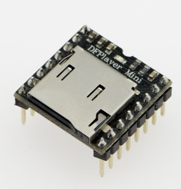
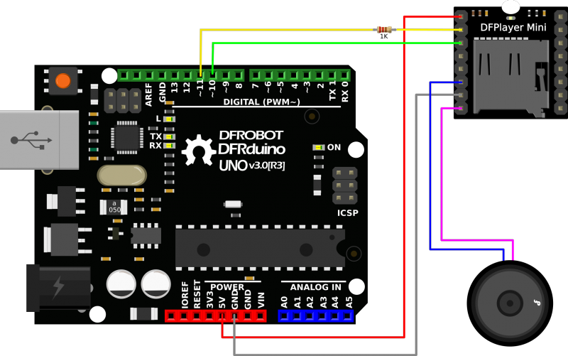

# Arduino_MP3_DFPlayer
How to use the DF Robot DF Player Mini to play MP3 files with an Arduino

The DFPlayer Mini MP3 Player with built in amplification on a breakout board 
The module can be used as a stand alone module with attached battery, speaker and push buttons or used in combination with microcontroller with RX/TX capabilities.

These modules can be purchased on [Amazon](https://www.amazon.com/gp/product/B01MQD5IIA)

DFPlayer Mini MP3 Player [Overview and Specs](https://wiki.dfrobot.com/DFPlayer_Mini_SKU_DFR0299)

## Hardware & Setup

 
 

## Other Examples: 

https://www.dfrobot.com/blog-277.html

http://educ8s.tv/arduino-mp3-player/
